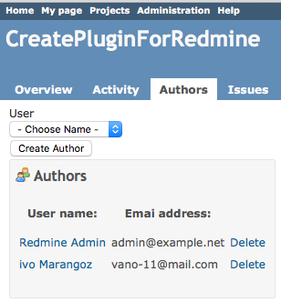
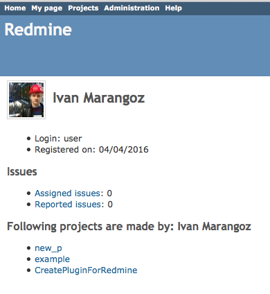
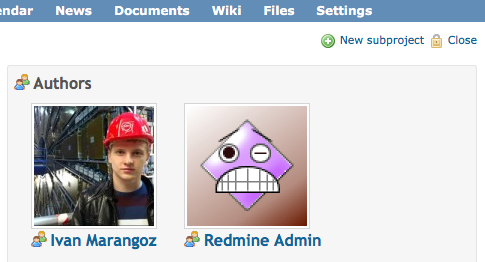

Redmine Authors
==================

This plugin lets you to add authors to your projects.


Compatibility
-------------

This version is supported by Redmine 3.2.1


Installation and Setup
----------------------

* Clone or [download](https://github.com/frywer/authors/archive/master.zip) this repo into your **redmine_root/plugins/** folder

```
$ git clone https://github.com/frywer/authors.git
```
* If you downloaded a tarball / zip from master branch, make sure you rename the extracted folder to `authors`
* You have to run the plugin rake task to provide the assets (from the Redmine root directory):
```
$ rake redmine:plugins:migrate RAILS_ENV=production
```
* Restart redmine

* You can activate avatar image in **administration->settings->Display** and choose 'Use Gravatar user icons'

Examples of the plugin in use
------------------------------

<p align="center">



</p>

